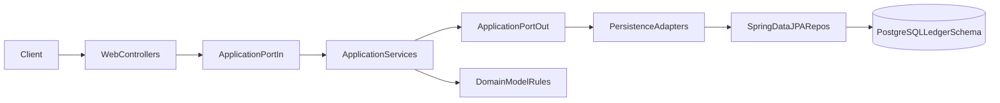

# Ledger-Service Documentation Plan

## Scope

Create 13 Markdown documents in `[/home/zacharykingcade/Documents/code_projects/ZK-Budgeting-Application/documentation/ledger-service](/home/zacharykingcade/Documents/code_projects/ZK-Budgeting-Application/documentation/ledger-service)`, one for each requested section:

- Overview
- Architecture
- Project Structure
- Domain Model
- Use Cases
- Ports & Adapters
- Database Design
- Accounting Model
- API Design
- Error Handling
- Logging
- Running Locally
- Future Improvements (outline-only)

## Source of Truth

Use current implementation from:

- Controllers: `[/home/zacharykingcade/Documents/code_projects/ZK-Budgeting-Application/ledger-service/src/main/java/zachkingcade/dev/ledger/adapter/in/web](/home/zacharykingcade/Documents/code_projects/ZK-Budgeting-Application/ledger-service/src/main/java/zachkingcade/dev/ledger/adapter/in/web)`
- Application services and ports: `[/home/zacharykingcade/Documents/code_projects/ZK-Budgeting-Application/ledger-service/src/main/java/zachkingcade/dev/ledger/application](/home/zacharykingcade/Documents/code_projects/ZK-Budgeting-Application/ledger-service/src/main/java/zachkingcade/dev/ledger/application)`
- Domain: `[/home/zacharykingcade/Documents/code_projects/ZK-Budgeting-Application/ledger-service/src/main/java/zachkingcade/dev/ledger/domain](/home/zacharykingcade/Documents/code_projects/ZK-Budgeting-Application/ledger-service/src/main/java/zachkingcade/dev/ledger/domain)`
- Persistence adapters/entities/repos: `[/home/zacharykingcade/Documents/code_projects/ZK-Budgeting-Application/ledger-service/src/main/java/zachkingcade/dev/ledger/adapter/out/persistence](/home/zacharykingcade/Documents/code_projects/ZK-Budgeting-Application/ledger-service/src/main/java/zachkingcade/dev/ledger/adapter/out/persistence)`
- DB migration: `[/home/zacharykingcade/Documents/code_projects/ZK-Budgeting-Application/ledger-service/src/main/resources/db/migration/V1__Init.sql](/home/zacharykingcade/Documents/code_projects/ZK-Budgeting-Application/ledger-service/src/main/resources/db/migration/V1__Init.sql)`
- Config/logging/runtime: `[/home/zacharykingcade/Documents/code_projects/ZK-Budgeting-Application/ledger-service/src/main/resources/application.yml](/home/zacharykingcade/Documents/code_projects/ZK-Budgeting-Application/ledger-service/src/main/resources/application.yml)`, `[/home/zacharykingcade/Documents/code_projects/ZK-Budgeting-Application/ledger-service/src/main/resources/logback-spring.xml](/home/zacharykingcade/Documents/code_projects/ZK-Budgeting-Application/ledger-service/src/main/resources/logback-spring.xml)`, `[/home/zacharykingcade/Documents/code_projects/ZK-Budgeting-Application/docker-compose.yml](/home/zacharykingcade/Documents/code_projects/ZK-Budgeting-Application/docker-compose.yml)`

## Planned Deliverables

- Add new files with consistent naming in `documentation/ledger-service`:
  - `Overview.md`
  - `Architecture.md`
  - `ProjectStructure.md`
  - `DomainModel.md`
  - `UseCases.md`
  - `PortsAndAdapters.md`
  - `DatabaseDesign.md`
  - `AccountingModel.md`
  - `ApiDesign.md`
  - `ErrorHandling.md`
  - `Logging.md`
  - `RunningLocally.md`
  - `FutureImprovements.md` (outline/template only)
- Keep existing `[/home/zacharykingcade/Documents/code_projects/ZK-Budgeting-Application/documentation/ledger-service/Endpoints.md](/home/zacharykingcade/Documents/code_projects/ZK-Budgeting-Application/documentation/ledger-service/Endpoints.md)` unchanged unless you want it replaced/merged later.

## Documentation Content Approach

- **Overview:** Purpose, bounded context, key capabilities, and current maturity.
- **Architecture:** Hexagonal/Ports-and-Adapters explanation, request flow, and component responsibilities.
- **Project Structure:** Package-by-package breakdown with why each package exists.
- **Domain Model:** Entities, relationships, invariants, and notable constraints.
- **Use Cases:** CRUD + retrieval flows per aggregate and service responsibilities.
- **Ports & Adapters:** Explicit mapping tables (inbound ports/controllers, outbound ports/persistence adapters).
- **Database Design:** Schema/table relationships, constraints, indexes, and migration approach.
- **Accounting Model:** Double-entry rules, balancing enforcement, and debit/credit semantics.
- **API Design:** Endpoint conventions, DTO patterns, status codes, and current consistency gaps.
- **Error Handling:** Exception taxonomy and `GlobalExceptionHandler` response mapping.
- **Logging:** Logback config, levels, destinations, and current logging strategy.
- **Running Locally:** Prereqs, startup sequence, commands, and troubleshooting notes.
- **Future Improvements:** Structured headings/checklists only (no filled details yet).

## Architecture Visualization (to include in docs)

## Validation Pass

- Verify each new doc references actual class/file names and endpoint paths from code.
- Ensure `running-locally.md` reflects current config (including noted autoconfiguration exclusions in `application.yml`).
- Add a lightweight index section in each file for scanability (headings + bullets).

