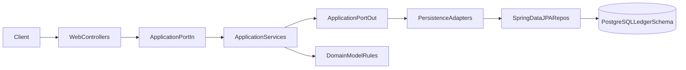

# Ledger service architecture

**Purpose**: Describe how `ledger-service` is built and why it is structured this way.
 
Last updated: 2026-04-22

Back to: [Ledger service guide](../guide-ledger-service.md)

## Architectural style

This service follows a Ports and Adapters (Hexagonal) approach to keep business rules isolated from transport (HTTP) and storage (JPA/Postgres).

- **Inbound adapters**: web controllers
- **Application**: use-case interfaces and service implementations
- **Outbound ports**: repository contracts
- **Outbound adapters**: persistence adapters (JPA)
- **Domain**: business invariants and accounting rules

## Clean Architecture in this service

This service implements a pragmatic form of Clean Architecture:

- **Domain**: business concepts and invariants (double-entry rules). No Spring annotations.
- **Application**: use cases and orchestration. Depends on ports, not concrete adapters.
- **Adapters**: web controllers, DTOs, persistence implementations (JPA), configuration.

See: [`../standards/microservice-springboot-consistency.md`](../standards/microservice-springboot-consistency.md) and ADRs under `../ADR/`.

## Request flow

## Main components

Code is canonical for exact package paths and class names.

- Boot entrypoint: `ledger/LedgerApplication`
- Web layer: `adapter/in/web/*Controller`
- Ports: `application/port/in/**`, `application/port/out/**`
- Use-case implementations: `application/*Service`
- Persistence adapters: `adapter/out/persistence/*PersistenceAdapter`
- JPA: `adapter/out/persistence/jpa/*Entity`, `adapter/out/persistence/repository/*JpaRepository`

## Why ports and adapters here?

- **Testability**: application/domain logic is exercised without HTTP or database wiring.
- **Replaceable adapters**: persistence or transport can evolve without rewriting domain rules.
- **Clear responsibilities**: prevents “fat controllers” and domain logic leaking into JPA entities.

