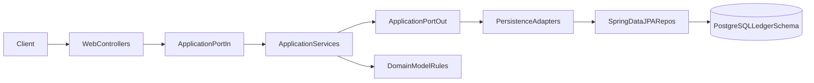

# Ledger Service Architecture

## Architectural Style
The service follows a Ports and Adapters approach:
- Inbound adapters: web controllers.
- Application layer: use-case interfaces and service implementations.
- Outbound ports: repository contracts.
- Outbound adapters: JPA persistence adapters.
- Domain model: business invariants and accounting rules.

## Request Flow

## Main Components
- Boot entrypoint: `ledger/LedgerApplication`.
- Web layer: `adapter/in/web/*Controller`.
- Use-case and orchestration: `application/*Service`.
- Port contracts: `application/port/in/**`, `application/port/out/**`.
- Persistence adapters: `adapter/out/persistence/*PersistenceAdapter`.
- Database mappings: `adapter/out/persistence/jpa/*Entity`.

## Design Notes
- Controllers depend on inbound ports, not concrete services.
- Services depend on outbound ports, not JPA repositories directly.
- Domain validation is centralized in domain constructors/factories.
